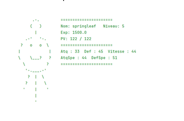

🧩 4) La classe IndividuMonstre

📘 Définition de la classe

La classe IndividuMonstre représente chaque monstre individuel avec lequel le joueur interagit :
les monstres sauvages, ceux du joueur ou encore ceux des autres dresseurs.

Chaque monstre possède ses propres caractéristiques, contrairement à l’espèce de base (EspeceMonstre).
Il peut :

Gagner de l’expérience et monter de niveau,

Attaquer d’autres monstres,

Être renommé,

Afficher ses statistiques et son art ASCII.

⚙️ Code de la classe

``` kotlin
package monstre

import kotlin.math.*
import kotlin.random.Random

/**
 * Représente un monstre individuel (capturé, sauvage ou appartenant à un dresseur).
 * Chaque individu hérite des caractéristiques de son espèce,
 * mais possède ses propres valeurs (aléatoires) et peut évoluer avec l'expérience.
 */
class IndividuMonstre(
    val id: Int,                       // Identifiant unique du monstre
    var nom: String,                   // Nom du monstre (modifiable)
    val espece: EspeceMonstre,         // Référence vers l'espèce de base
    var entraineur: Entraineur? = null,// Dresseur propriétaire du monstre (null = sauvage)
    expInit: Double                    // Expérience initiale du monstre
) {

    // ========================================================
    // 🔹 EXPÉRIENCE & NIVEAU
    // ========================================================

    var experience: Double = 0.0
        set(value) {
            field = value
            // Vérifie si le monstre a assez d'expérience pour monter de niveau
            while (field >= palierExp(niveau + 1)) {
                levelUp()
            }
        }

    var niveau: Int = 1  // Niveau du monstre (commence à 1)

    /**
     * Calcule le seuil d’expérience nécessaire pour atteindre un niveau donné.
     * Ici, on utilise une fonction quadratique simple : 100 * (niveau-1)²
     */
    fun palierExp(niveau: Int): Double {
        return 100 * (niveau - 1).toDouble().pow(2.0)
    }

    // ========================================================
    // 🔹 STATISTIQUES DE BASE
    // ========================================================

    // Les caractéristiques varient légèrement autour de la valeur de base de l’espèce.
    var attaque: Int = espece.baseAttaque + Random.nextInt(-2, 3)
    var defense: Int = espece.baseDefense + Random.nextInt(-2, 3)
    var vitesse: Int = espece.baseVitesse + Random.nextInt(-2, 3)
    var attaqueSpe: Int = espece.baseAttaqueSpe + Random.nextInt(-2, 3)
    var defenseSpe: Int = espece.baseDefenseSpe + Random.nextInt(-2, 3)
    var pvMax: Int = espece.basePv + Random.nextInt(-5, 6)
    var potentiel: Double = Random.nextDouble(0.5, 2.0) // Coefficient de croissance unique

    // ========================================================
    // 🔹 POINTS DE VIE (PV)
    // ========================================================

    var pv: Int = pvMax
        set(value) {
            // Les PV ne peuvent jamais dépasser le max ni descendre en dessous de 0
            field = when {
                value < 0 -> 0
                value > pvMax -> pvMax
                else -> value
            }
        }

    // ========================================================
    // 🔹 INITIALISATION
    // ========================================================

    init {
        this.experience = expInit // applique le setter avec vérification du niveau
    }

    // ========================================================
    // 🔹 MÉTHODE levelUp() → Augmentation de niveau
    // ========================================================

    /**
     * Monte le monstre d’un niveau et améliore légèrement ses statistiques.
     */
    fun levelUp() {
        niveau += 1

        val modCaracteristique = 2.0 // Coefficient d'amélioration

        // Fonction interne : améliore une caractéristique de base
        fun calcCarac(): Int {
            val base = round(modCaracteristique * potentiel).toInt()
            val alea = Random.nextInt(-2, 3)
            return base + alea
        }

        // Fonction interne : améliore les PV max
        fun calcPvMax(): Int {
            val base = round(modCaracteristique * potentiel).toInt()
            val alea = Random.nextInt(-5, 6)
            return base + alea
        }

        // Augmente chaque caractéristique
        attaque += calcCarac()
        defense += calcCarac()
        vitesse += calcCarac()
        attaqueSpe += calcCarac()
        defenseSpe += calcCarac()

        // Augmente les PV max et soigne en même temps
        val pvMaxGagne = calcPvMax()
        pvMax += pvMaxGagne
        pv += pvMaxGagne

        // Empêche les valeurs négatives
        attaque = maxOf(attaque, 0)
        defense = maxOf(defense, 0)
        vitesse = maxOf(vitesse, 0)
        attaqueSpe = maxOf(attaqueSpe, 0)
        defenseSpe = maxOf(defenseSpe, 0)
        pvMax = maxOf(pvMax, 1)
        pv = pv.coerceIn(0, pvMax)

        println("✨ ${nom} monte au niveau $niveau !")
    }

    // ========================================================
    // 🔹 MÉTHODE attaquer()
    // ========================================================

    /**
     * Permet à ce monstre d'attaquer un autre.
     * Les dégâts dépendent de l’attaque et de la défense.
     */
    fun attaquer(cible: IndividuMonstre) {
        val degatsBruts = attaque - (cible.defense / 2)
        val degats = if (degatsBruts < 1) 1 else degatsBruts // minimum 1 dégât
        cible.pv -= degats
        println("${nom} attaque ${cible.nom} et inflige $degats dégâts !")
        println("${cible.nom} a maintenant ${cible.pv}/${cible.pvMax} PV.")
    }

    // ========================================================
    // 🔹 MÉTHODE renommer()
    // ========================================================

    /**
     * Permet de changer le nom du monstre depuis la console.
     */
    fun renommer() {
        print("Entrez un nouveau nom pour ${nom} (laisser vide pour garder le même) : ")
        val nouveauNom = readLine()?.trim() ?: ""
        if (nouveauNom.isNotEmpty()) {
            nom = nouveauNom
            println("✅ Le monstre a été renommé en $nom")
        } else {
            println("ℹ️ Le nom n'a pas été modifié.")
        }
    }

    // ========================================================
    // 🔹 MÉTHODE afficheDetail()
    // ========================================================

    /**
     * Affiche l'art ASCII de l'espèce et les détails du monstre côte à côte.
     */
    fun afficheDetail() {
        // Nettoie les retours de ligne pour un affichage propre
        val art = espece.afficheArt().replace("\r\n", "\n").replace("\r", "\n")
        val artLines = art.lines()

        // Prépare la liste de détails à afficher
        val details = listOf(
            "Nom : $nom",
            "Espèce : ${espece.nom}",
            "Type : ${espece.type}",
            "Niveau : $niveau",
            "PV : $pv/$pvMax",
            "Attaque : $attaque",
            "Défense : $defense",
            "Vitesse : $vitesse",
            "Attaque Spé : $attaqueSpe",
            "Défense Spé : $defenseSpe",
            "Expérience : ${"%.2f".format(experience)}",
            "Entraîneur : ${entraineur?.nom ?: "Aucun"}"
        )

        // Calcule la largeur maximale de l’art ASCII pour aligner les textes
        val ansiRegex = "\u001B\\[[;\\d]*m".toRegex()
        val maxArtWidth = artLines.maxOfOrNull { it.replace(ansiRegex, "").length } ?: 0
        val maxLines = maxOf(artLines.size, details.size)

        // Affiche ligne par ligne l’art + les infos
        for (i in 0 until maxLines) {
            val artLine = if (i < artLines.size) artLines[i] else ""
            val detailLine = if (i < details.size) details[i] else ""
            val paddedArt = artLine.padEnd(maxArtWidth + 4)
            println(paddedArt + detailLine)
        }
    }
}

```
🧪 Dans le fichier Main.kt
```kotlin
val monstre1 = IndividuMonstre(1, "springleaf", especeSpringleaf, joueur, 0.0)
val monstre2 = IndividuMonstre(2, "flamkip", especeFlamkip, joueur, 0.0)
val monstre3 = IndividuMonstre(3, "aquamy", especeAquamy, joueur, 0.0)

monstre1.attaquer(monstre2)
monstre2.attaquer(monstre1)
monstre1.attaquer(monstre3)
monstre3.attaquer(monstre1)

monstre1.renommer()
monstre2.renommer()
monstre3.renommer()

monstre1.afficheDetail()
monstre2.afficheDetail()
monstre3.afficheDetail()
```

✅ Résultats attendus

Les monstres se battent et leurs PV diminuent sans jamais devenir négatifs.

Le renommage fonctionne (avec un message de confirmation).

L’affichage combine l’art ASCII et les statistiques côte à côte.

Les montées de niveau déclenchent le message :

