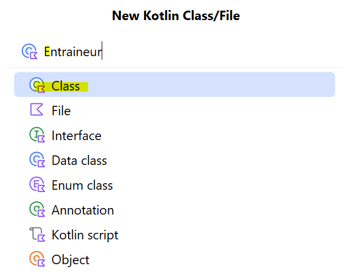

🏋️ Sprint 2 : Les classes — La classe Entraineur
🎯 Objectif

Créer une classe Kotlin pour représenter un entraîneur dans le jeu avec ses propriétés, méthodes et tests d’instanciation.

🧩 1. Définition de la classe

Dans le package dresseur, créez une nouvelle classe Kotlin :
New > Kotlin Class/File > Entraineur



✨ But d’une classe

Propriétés : stocker les données (ex : id, nom, argent)

Méthodes : définir les actions que chaque objet peut effectuer (ex : afficheDetail())

Chaque objet de la classe partage les mêmes propriétés et méthodes, mais les valeurs des propriétés peuvent varier.

📄 Code et documentation de la classe Entraineur
``` kotlin
package dresseur

import org.example.IndividuMonstre
import org.example.Item

/**
* Représente un entraîneur dans le jeu.
*
* @property id L'identifiant unique de l'entraîneur.
* @property nom Le nom de l'entraîneur.
* @property argent La somme d'argent possédée par l'entraîneur.
  */
  class Entraineur(
  var id: Int,
  var nom: String,
  var argent: Int
  ) {
  // Liste des monstres actuellement dans l'équipe
  var equipeMonstre: MutableList<IndividuMonstre> = mutableListOf()

  // Boîte de stockage pour les monstres supplémentaires
  var boiteMonstre: MutableList<IndividuMonstre> = mutableListOf()

  // Sac contenant des objets (Item)
  var SacAItems: MutableList<Item> = mutableListOf()

  /**
    * Affiche les détails de l'entraîneur : ID, nom et argent.
      */
      fun afficheDetail() {
      println("ID : ${this.id}")
      println("Nom : ${this.nom}")
      println("Argent : ${this.argent}")
      }
      } // Fin de la classe Entraineur
```
🧪 2. Instanciation d’objets et tests
Création d’objets de la classe
``` kotlin
var joueur = Entraineur(1, "Sacha", 100)
var rival = Entraineur(2, "Regis", 200)
```
Remplacer le main() pour tester
``` kotlin
fun main() {
// Affichage initial des détails
println("Dresseur : ${joueur.nom}")
println("Argent : ${joueur.argent}")
println("Dresseur : ${rival.nom}")
println("Argent : ${rival.argent}")

    // Modification de l'argent du joueur
    joueur.argent += 50
    println("Argent après gain : ${joueur.argent}")

    // Affichage via la méthode afficheDetail()
    joueur.afficheDetail()
    rival.afficheDetail()
}
```

Explications

Propriétés supplémentaires :

equipeMonstre → l'équipe active du joueur

boiteMonstre → stockage supplémentaire des monstres

SacAItems → inventaire d'objets

Méthode afficheDetail() :

Affiche l’ID, le nom et l’argent de l’entraîneur

this fait référence à l’objet appelant (joueur ou rival)

Test et modification :

joueur.argent += 50 → seul le joueur est affecté, le rival reste inchangé

afficheDetail() permet de vérifier rapidement l’état actuel des objets

Debugging avec IntelliJ :

Placez un point d’arrêt sur une ligne

Lancez le mode debug

Utilisez Step over pour avancer ligne par ligne ou Step into pour entrer dans les méthodes

Permet de comprendre le flux d’exécution et l’état des objets

📌 Résumé

Création de la classe Entraineur avec propriétés et méthodes.

Instanciation de plusieurs objets et tests de modification des propriétés.

Découverte du mot-clé this qui fait référence à l’objet appelant.

Premiers pas avec le mode debug pour suivre l’exécution et inspecter les variables.

