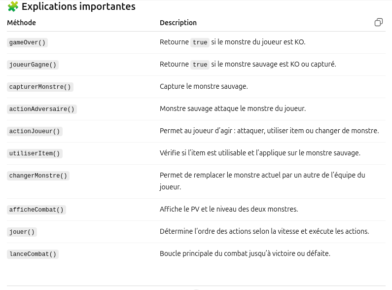

Partie 9 Classe CombatMonstre
🎯 Concept

CombatMonstre gère un combat entre :

Le monstre du joueur (monstreJoueur)

Un monstre sauvage (monstreSauvage)

La classe inclut :

La gestion des rounds

Les actions du joueur et de l’adversaire

Les conditions de victoire ou de défaite

L’utilisation d’items et le changement de monstre

📌 Code 
```kotlin
/**
 * Classe représentant un combat entre deux monstres.
 *
 * @param monstreJoueur Le monstre du joueur
 * @param monstreSauvage Le monstre sauvage adverse
 */
class CombatMonstre(
    val monstreJoueur: IndividuMonstre,
    val monstreSauvage: IndividuMonstre
) {
    var round: Int = 1 // Numéro du round courant
    var monstreCapture: Boolean = false // Indique si le monstre sauvage a été capturé

    /**
     * Vérifie si le joueur a perdu le combat.
     * @return true si le monstre du joueur est KO
     */
    fun gameOver(): Boolean {
        return monstreJoueur.pv <= 0 // KO si PV <= 0
    }

    /**
     * Vérifie si le joueur a gagné le combat.
     * Deux conditions : capture ou KO du monstre sauvage
     * @return true si le joueur a gagné
     */
    fun joueurGagne(): Boolean {
        // Victoire si capture du monstre
        if (monstreCapture) return true
        // Victoire si le monstre sauvage est KO
        if (monstreSauvage.pv <= 0) return true
        return false
    }

    /**
     * Capture le monstre sauvage
     */
    fun capturerMonstre() {
        monstreCapture = true
    }

    /**
     * Action de l'adversaire (monstre sauvage)
     * Attaque le monstre du joueur si PV > 0
     */
    fun actionAdversaire() {
        if (monstreSauvage.pv > 0) {
            monstreSauvage.attaquer(monstreJoueur)
            println("${monstreSauvage.nom} attaque ${monstreJoueur.nom} !")
            println("${monstreJoueur.nom} a maintenant ${monstreJoueur.pv} PV.")
        } else {
            println("${monstreSauvage.nom} ne peut pas attaquer car il est KO.")
        }
    }

    /**
     * Action du joueur
     * 1 : Attaquer
     * 2 : Utiliser un item
     * 3 : Changer de monstre
     * @return true si le combat continue, false sinon
     */
    fun actionJoueur(): Boolean {
        if (gameOver()) return false

        println("Que souhaitez-vous faire ?")
        println("1 : Attaquer")
        println("2 : Utiliser un item")
        println("3 : Changer de monstre")
        print("Entrez votre choix : ")

        val choix = readLine()?.toIntOrNull() ?: 0

        when (choix) {
            1 -> {
                // Attaque du monstre joueur
                monstreJoueur.attaquer(monstreSauvage)
                println("${monstreJoueur.nom} attaque ${monstreSauvage.nom} !")
            }
            2 -> {
                // Utilisation d'un item
                if (!utiliserItem()) println("Action échouée, le combat continue.")
            }
            3 -> changerMonstre() // Changement de monstre
            else -> println("Choix invalide.")
        }

        // Continue le combat si le monstre sauvage n'est pas KO et le joueur pas KO
        return !(monstreSauvage.pv <= 0 || gameOver())
    }

    /**
     * Utilisation d'un item sur le monstre sauvage
     */
    fun utiliserItem(): Boolean {
        if (joueur.SacAItems.isEmpty()) {
            println("Votre sac est vide !")
            return false
        }

        println("Voici vos items :")
        joueur.SacAItems.forEachIndexed { index, item ->
            println("$index : ${item.nom} - ${item.description}")
        }

        print("Entrez l'indice de l'item à utiliser : ")
        val index = readLine()?.toIntOrNull() ?: -1

        if (index in joueur.SacAItems.indices) {
            val item: Item = joueur.SacAItems[index]
            if (item is utilisable) {
                val succes = item.utiliser(monstreSauvage)
                if (succes) println("Vous avez utilisé ${item.nom} avec succès.")
                else println("L'utilisation de ${item.nom} a échoué.")
                return succes
            } else println("Cet item ne peut pas être utilisé.")
        } else println("Choix invalide.")
        return false
    }

    /**
     * Permet de changer de monstre dans l'équipe
     */
    fun changerMonstre() {
        println("Équipe de monstres disponibles :")
        joueur.equipeMonstre.forEachIndexed { index, monstre ->
            println("$index : ${monstre.nom} (PV: ${monstre.pv})")
        }

        print("Entrez l'indice du monstre à envoyer : ")
        val index = readLine()?.toIntOrNull() ?: -1

        if (index in joueur.equipeMonstre.indices) {
            val choixMonstre = joueur.equipeMonstre[index]
            if (choixMonstre.pv > 0) println("${choixMonstre.nom} remplace ${monstreJoueur.nom} !")
            else println("Impossible ! Ce monstre est KO.")
        } else println("Choix invalide.")
    }

    /**
     * Affiche l'état des deux monstres en combat
     */
    fun afficheCombat() {
        println("===================================")
        println(" Début du round $round")
        println("===================================")
        println("Monstre sauvage : ${monstreSauvage.nom}")
        println("Niveau : ${monstreSauvage.niveau}")
        println("PV : ${monstreSauvage.pv} / ${monstreSauvage.pvMax}")
        println()
        println("Monstre Joueur : ${monstreJoueur.nom}")
        println("Niveau : ${monstreJoueur.niveau}")
        println("PV : ${monstreJoueur.pv} / ${monstreJoueur.pvMax}")
    }

    /**
     * Gestion du round
     * Le monstre le plus rapide agit en premier
     */
    fun jouer() {
        if (monstreJoueur.vitesse >= monstreSauvage.vitesse) {
            if (!actionJoueur()) return
            if (!monstreCapture && monstreSauvage.pv > 0) actionAdversaire()
        } else {
            if (monstreSauvage.pv > 0) actionAdversaire()
            if (!gameOver()) if (!actionJoueur()) return
        }
    }

    /**
     * Lance le combat complet
     * Continue jusqu'à victoire ou défaite
     */
    fun lanceCombat() {
        while (!gameOver() && !joueurGagne()) {
            jouer()
            println("======== Fin du Round : $round ========")
            round++
        }
        if (gameOver()) {
            // Restaure tous les PV des monstres du joueur
            joueur.equipeMonstre.forEach { it.pv = it.pvMax }
            println("Game Over !")
        }
    }
}


```


🧪 Main.kt
```kotlin
fun main() {
    val monstreJoueur = IndividuMonstre(5, "Pika", especeFlamkip, joueur, expInit = 0.0).apply {
        pv = 100
        pvMax = 100
        vitesse = 30
    }

    val monstreSauvage = IndividuMonstre(1, "Aqaman", especeAquamy, expInit = 0.0).apply {
        pv = 100
        pvMax = 100
        vitesse = 25
    }

    joueur.equipeMonstre.add(monstreJoueur)

    val combat = CombatMonstre(monstreJoueur, monstreSauvage)
    println("Début du combat entre ${monstreJoueur.nom} et ${monstreSauvage.nom}")

    combat.lanceCombat() // Lance le combat
    println("Fin du combat.")
}


```

✅ Points clés

Le combat se déroule round par round.

La vitesse détermine l’ordre des actions.

Le joueur peut : attaquer, utiliser un item ou changer de monstre.

Conditions de fin de combat :

Défaite → PV du joueur KO.

Victoire → monstre sauvage KO ou capturé.

Restaure les PV du joueur en cas de défaite.