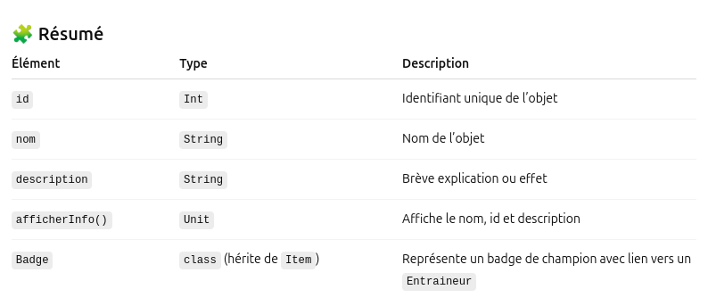

🧩 5) Classe Item
📘 Définition

La classe Item représente les objets que le joueur peut posséder, comme des potions, des objets clés ou des badges de champion.
Pour l’instant, elle est simple et contient seulement trois propriétés :

id → identifiant unique de l’objet,

nom → nom de l’objet,

description → courte description de l’objet.

Une méthode afficherInfo() permet d’afficher ces informations à la console.

Plus tard, d’autres classes comme Badge ou Potion hériteront de Item.

🧱 Code complet commenté
``` kotlin
package org.example

import dresseur.Entraineur

/**
 * Classe de base représentant un objet (Item) dans le jeu.
 * Les objets peuvent être des potions, des badges, ou d'autres éléments.
 */
open class Item(
    val id: Int,             // Identifiant unique de l'objet
    val nom: String,         // Nom de l'objet
    val description: String  // Brève description de l'objet
) {

    /**
     * Affiche les informations principales de l'objet dans la console.
     */
    fun afficherInfo() {
        println("🎒 Item : $nom (ID: $id)")
        println("📝 Description : $description")
    }

    // ==========================================================
    // 🔹 Sous-classe : Badge
    // ==========================================================
    /**
     * Représente un badge obtenu après avoir vaincu un champion d'arène.
     * Hérite de la classe Item.
     *
     * @property champion L'entraîneur (champion) associé au badge.
     */
    class Badge(
        id: Int,
        nom: String,
        description: String,
        var champion: Entraineur
    ) : Item(id, nom, description)
}
```
🧪 Exemple d’utilisation (dans main.kt)
``` kotlin
package org.example``
import dresseur.Entraineur
import org.example.Item

fun main() {
// Création d'un champion associé au badge
val championFeu = Entraineur(10, "Flamina", 15)

    // Création d'un badge
    val badgeFeu = Item.Badge(
        1,
        "Badge de Feu",
        "Obtenu après avoir vaincu le champion du type Feu.",
        championFeu
    )

    // Affichage des informations
    badgeFeu.afficherInfo()
    println("🏆 Champion associé : ${badgeFeu.champion.nom}")
}
```


