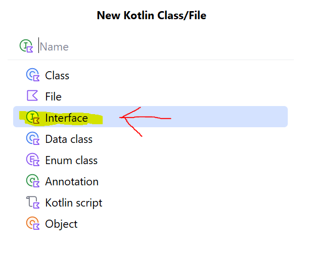

Sprint 2 – Partie 7 : Interface Utilisable
🎯 Concept

Certains items (comme les MonsterKubes ou les potions) sont utilisables en combat, alors que d’autres (comme les badges) ne le sont pas.

Pour gérer cela, on utilise une interface :

Une interface définit un contrat que les classes doivent respecter.

Les classes qui implémentent l’interface doivent fournir la même méthode avec la même signature.

Une interface n’a pas de propriétés et on ne peut pas créer d’objet directement à partir d’une interface.


📌 Interface Utilisable
``` kotlin

/**
* Interface définissant le comportement d'un objet
* pouvant être utilisé sur un [IndividuMonstre].
  */
  interface Utilisable {

  /**
    * Applique l'effet de l'objet sur le monstre cible.
    *
    * @param cible Le [IndividuMonstre] ciblé.
    * @return `true` si l'action a eu un effet (ex. capture réussie, soin appliqué), sinon `false`.
      */
      fun utiliser(cible: IndividuMonstre): Boolean
      }
```

🧪 Exemple de test dans main()
``` kotlin
fun main() {
    val monstre = IndividuMonstre(
        id = 1,
        nom = "Drako",
        espece = especeDrako,
        expInit = 0.0
    )

    println("=== Situation initiale ===")
    println("${monstre.nom} : ${monstre.pv}/${monstre.pvMax} PV\n")

    println("=== Utilisation du kube ===")
    kube.utiliser(monstre)

    println("=== Tentative d’utilisation du badge ===")
    // Les badges ne sont pas utilisables, donc pas d’effet

    println("=== Liste des objets utilisables ===")
    val objets: List<Utilisable> = listOf(kube)
    for (objet in objets) {
        objet.utiliser(monstre)
    }
}
```
📌 Résumé

L’interface Utilisable permet de gérer tous les items qui peuvent être appliqués sur un monstre.

Les classes comme MonsterKube ou Potion devront implémenter cette interface.

Les badges ou autres items non-combat ne l’implémentent pas.